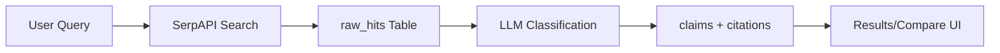
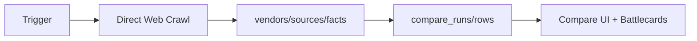
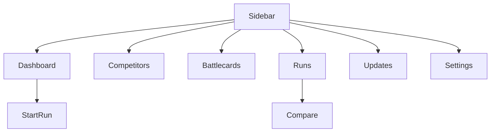

# DealForge Context Pack

## TL;DR
- **Next.js 15.5.2** competitive intelligence platform
- **Two pipelines**: Legacy (SerpAPI → LLM) and Facts (direct crawl → structured data)
- **Clerk auth** + **Supabase DB** with RLS
- **Web crawling** with optional headless rendering
- **Battlecards** and **comparison tables** for sales teams

## Routes
```
/ → Landing
/dashboard → Main dashboard
/competitors → Competitor management
/battlecards → Battlecard views
/app/runs → Run management
/app/updates → Update notifications
/settings → User settings
/compare/[runId] → Comparison results
/onboarding → User onboarding
```

## API Contracts
```typescript
// Start run
POST /api/runs/start
{ query: string } → { runId: string, status: string }

// Get run status
GET /api/runs/status/[id]
{ id } → { id, status, created_at }

// Competitors
GET /api/competitors → { competitors: Competitor[] }
POST /api/competitors
{ name: string, website?: string, aliases?: string[] }
→ { success: boolean, competitor: Competitor }

// Test facts pipeline
POST /api/test-facts-pipeline
{} → { success: boolean, message: string }
```

## Environment Variables
```bash
# Required
NEXT_PUBLIC_CLERK_PUBLISHABLE_KEY=pk_test_...
CLERK_SECRET_KEY=sk_test_...
NEXT_PUBLIC_SUPABASE_URL=https://xxx.supabase.co
SUPABASE_SERVICE_ROLE_KEY=eyJ...
SERPAPI_KEY=...

# Optional
OPENAI_API_KEY=sk-...
FACTS_PIPELINE_ENABLED=true
FACTS_HEADLESS_ENABLED=1
DRY_RUN=1
NEXT_PUBLIC_APP_URL=http://localhost:3000
```

## Diagrams

### Legacy Pipeline


### Facts Pipeline


### UI Navigation


## Key Files by Feature

### Authentication
- `src/lib/authz.ts` - Auth requirements
- `src/app/layout.tsx` - Clerk provider
- `src/server/ensureOrg.ts` - Org setup

### Database
- `src/lib/supabaseServer.ts` - Server client
- `src/server/supabaseAdmin.ts` - Admin client
- `migrations/2025-09-21_facts_pipeline.sql` - Schema

### Data Collection
- `src/lib/collect/serp.ts` - SerpAPI integration
- `src/lib/facts/crawl.ts` - Web crawler
- `src/lib/facts/collectors/pricing.ts` - Pricing extractor
- `src/lib/facts/headless.ts` - Playwright integration

### UI Components
- `src/components/compare/` - Comparison UI
- `src/app/(app)/layout.tsx` - App layout
- `src/config/nav.ts` - Navigation config

### API Routes
- `src/app/api/runs/start/route.ts` - Start runs
- `src/app/api/competitors/route.ts` - Competitor CRUD
- `src/app/api/test-facts-pipeline/route.ts` - Pipeline test

## Database Schema
```sql
-- Core tables
vendors (id, org_id, name, website, official_site_confidence)
sources (id, vendor_id, metric, url, title, body, fetched_at)
facts (id, vendor_id, metric, key, value, citations, fact_score)
compare_runs (id, org_id, you_vendor_id, comp_vendor_id, version)
compare_rows (id, run_id, metric, you_text, comp_text, citations)
battlecard_bullets (id, run_id, section, text, citations, persona)
update_events (id, vendor_id, metric, type, old, new, severity)
personal_saves (id, user_id, org_id, base_run_id, name, snapshot)
org_snapshots (id, org_id, base_run_id, name, snapshot)
```

## Known Issues
1. **RLS Permission Denied** - Simplified policies allow all authenticated users
2. **Hardcoded Org UUID** - `/api/runs/start` uses fixed org ID
3. **Feature Flag Disabled** - Facts pipeline off by default
4. **Headless Dependencies** - Playwright requires separate install
5. **Dry Run Mode** - Persistence behavior changes with env var

## Scripts
```bash
npm run dev              # Start dev server
npm run smoke            # Run smoke tests
npm run dev:classify     # Test URL classification
npm run dev:crawl        # Test web crawling
npm run dev-pricing      # Test pricing extraction
npm run dev-features     # Test features extraction
npm run dev-integrations # Test integrations extraction
```
