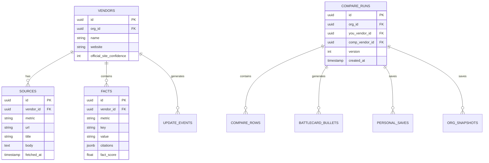

# DealForge Diagrams

## Data Pipelines

### Legacy Pipeline

### Facts Pipeline

## UI Navigation Flow

## Authentication Flow

## Database Relationships

## Web Crawling Process

## Facts Extraction Pipeline

## API Request Flow

## Component Hierarchy

