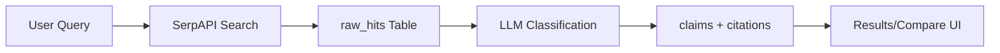
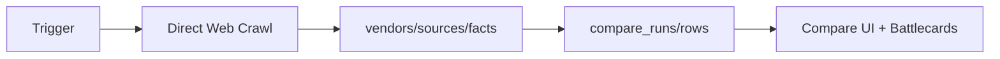

# DealForge - Project Technical Survey

## Executive Summary

DealForge is a competitive intelligence platform built with Next.js 15.5.2 that helps sales teams create battlecards and compare products against competitors. The application features two main data pipelines:

1. **Legacy Pipeline**: SerpAPI → raw_hits → LLM classification → claims/citations → Results UI
2. **Facts Pipeline**: Direct web crawling → vendors/sources/facts → compare_runs/rows → Compare UI

The platform uses Clerk for authentication, Supabase for data persistence, and includes sophisticated web crawling capabilities with optional headless rendering via Playwright.

## Repository Structure

```
web/
├── src/
│   ├── app/                    # Next.js App Router pages
│   │   ├── (app)/             # Protected app routes
│   │   ├── (auth)/            # Authentication routes
│   │   ├── api/               # API endpoints
│   │   └── compare/           # Comparison pages
│   ├── lib/                   # Core business logic
│   │   ├── facts/            # Facts pipeline implementation
│   │   ├── collect/          # Data collection utilities
│   │   └── supabaseServer.ts # Database client
│   ├── components/            # React components
│   └── server/               # Server-side utilities
├── migrations/               # Database migrations
├── scripts/                 # Development scripts
└── docs/                   # Documentation
```

## Route Map

### Pages
- `/` - Landing page
- `/dashboard` - Main dashboard
- `/competitors` - Competitor management
- `/battlecards` - Battlecard views
- `/app/runs` - Run management
- `/app/updates` - Update notifications
- `/settings` - User settings
- `/compare/[runId]` - Comparison results
- `/onboarding` - User onboarding
- `/welcome` - Welcome flow

### API Endpoints
- `POST /api/runs/start` - Start a new comparison run
- `GET /api/runs/status/[id]` - Get run status
- `GET /api/competitors` - List competitors
- `POST /api/competitors` - Add competitor
- `POST /api/test-facts-pipeline` - Test facts pipeline
- `GET /api/debug/*` - Debug endpoints
- `GET /api/diag/*` - Diagnostic endpoints

## Data Pipelines

### Legacy Pipeline


### Facts Pipeline


## Database Schema

### Core Tables
- **vendors**: Competitors and "us" records
- **sources**: Raw fetched pages with metadata
- **facts**: Atomic facts extracted from sources
- **compare_runs**: Comparison execution records
- **compare_rows**: Side-by-side comparison data
- **battlecard_bullets**: Battlecard content
- **update_events**: Change detection events
- **personal_saves**: User-specific saved comparisons
- **org_snapshots**: Organization-wide snapshots

### RLS Policies
All tables have Row Level Security enabled with simplified policies that allow all authenticated users access (for debugging). Service role has full access to all tables.

## Authentication & Authorization

### Clerk Integration
- User authentication via Clerk
- Organization-based access control
- JWT tokens for API authentication
- Hardcoded org UUID mapping (known issue)

### Supabase Integration
- Service role key for server-side operations
- RLS policies for data isolation
- Admin client for privileged operations

## Environment Variables

| Variable | Required | Used In | Example |
|----------|----------|---------|---------|
| `NEXT_PUBLIC_CLERK_PUBLISHABLE_KEY` | Yes | Layout, auth | `pk_test_...` |
| `CLERK_SECRET_KEY` | Yes | Server actions | `sk_test_...` |
| `NEXT_PUBLIC_SUPABASE_URL` | Yes | Database client | `https://xxx.supabase.co` |
| `SUPABASE_SERVICE_ROLE_KEY` | Yes | Server operations | `eyJ...` |
| `SERPAPI_KEY` | Yes | Search API | `...` |
| `OPENAI_API_KEY` | No | LLM classification | `sk-...` |
| `FACTS_PIPELINE_ENABLED` | No | Feature flag | `true` |
| `FACTS_HEADLESS_ENABLED` | No | Headless rendering | `1` |
| `DRY_RUN` | No | Development mode | `1` |

## Integrations

### External Services
- **SerpAPI**: Google search results for legacy pipeline
- **OpenAI**: LLM-based content classification
- **Playwright**: Headless browser rendering for SPA content
- **Clerk**: Authentication and user management
- **Supabase**: Database and real-time features

### Data Collection
- **Web Crawling**: Bounded BFS crawler with depth limits
- **Content Classification**: ML-based page type detection
- **Fact Extraction**: Specialized extractors for pricing, features, integrations
- **Headless Rendering**: Optional Chromium rendering for JS-heavy pages

## Known Issues & Blockers

1. **RLS Permission Errors**: Facts tables have simplified policies allowing all authenticated users
2. **Hardcoded Org UUID**: `/api/runs/start` uses hardcoded org ID instead of dynamic mapping
3. **Feature Flag Disabled**: Facts pipeline disabled by default (`FACTS_PIPELINE_ENABLED=false`)
4. **Headless Dependencies**: Playwright requires separate installation for headless rendering
5. **Dry Run Mode**: Persistence behavior changes based on `DRY_RUN` environment variable

## Development Scripts

- `npm run dev` - Start development server
- `npm run smoke` - Run smoke tests
- `npm run dev:classify` - Test URL classification
- `npm run dev:crawl` - Test web crawling
- `npm run dev-pricing` - Test pricing extraction
- `npm run dev-features` - Test features extraction
- `npm run dev-integrations` - Test integrations extraction

## UI Components

### Navigation
- Sidebar with Dashboard, Competitors, Battlecards, Runs, Updates, Settings
- Dark mode support via next-themes
- Responsive design with Tailwind CSS

### Key Components
- `CompareTable` - Side-by-side comparison display
- `AnswerScoreBadge` - Confidence scoring
- `CitationChip` - Source citations
- `StartRunForm` - Run initiation
- `CompetitorList` - Competitor management

## Build & Deployment

- **Framework**: Next.js 15.5.2 with App Router
- **Node Version**: 18.x+
- **TypeScript**: Full type safety
- **Styling**: Tailwind CSS with custom tokens
- **Icons**: Lucide React
- **Deployment**: Ready for Vercel (no specific config found)

## Open Questions

1. How should org UUID mapping be handled dynamically?
2. Should RLS policies be tightened for production?
3. What's the intended user flow for facts pipeline vs legacy?
4. How should headless rendering be configured in production?
5. What's the strategy for handling rate limits on external APIs?
